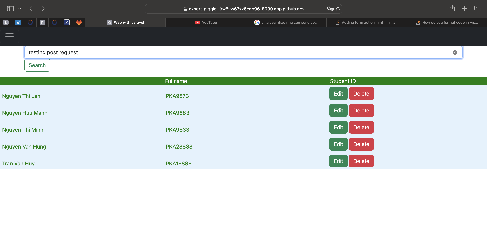
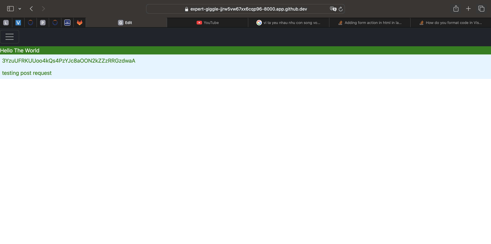

# Review Module 2 (Ôn tập nội dung học tuần thứ 3) 

```
Route
Controllers
View
Database
+ Migration
+ Eloquent ORM
Middleware
Authentication
Blade template
```

# Practice
# Simple Controller / Model /View

## Controller

```
<?php

namespace App\Http\Controllers;

use Illuminate\Http\Request;
use App\Models\Student;

class StudentController extends Controller
{
    public function listStudent(){
        $students = Student::all();
        return view('Student', compact('students'));
    }
   
}
```
## View

<html>

  <body>
     <form action="{{route('edit')}}" method="post">
    @foreach($students as $st)
     
            <div class="row align-items-end" style="background-color: #e3f2fd; color:green; padding: 6px">

                <div class="col">

                    {{ $st->studentFullName}}

                </div>
                <div class="col">

                    {{ $st->studentIDNumber}}

                </div>


                <div class="col">
                    <button type="button" class="btn btn-success">Edit</button>
                    <button type="button" class="btn btn-danger">Delete</button>


                </div>
            </div>
            <div class="row " style="background-color: white; "></div>
    @endforeach
        </div>
    </form>
  </body>
</html>


## Route

```

Route::get('/student', 'App\Http\Controllers\StudentController@listStudent');

Route::get('/bookDisplay',[BookController::class, 'index'] )->name('book');

Route::post('/book',[BookController::class, 'sendData']);
```
# POST /GET Request and Response

Understanding POST GET Request and Response (HTTP)






## Testing POST GET Request Response

+ Using Postman
  
  

+ Talend API Tester

  

# Question /Answers (Câu hỏi và câu trả lời)

# Hanoi, 2024 
